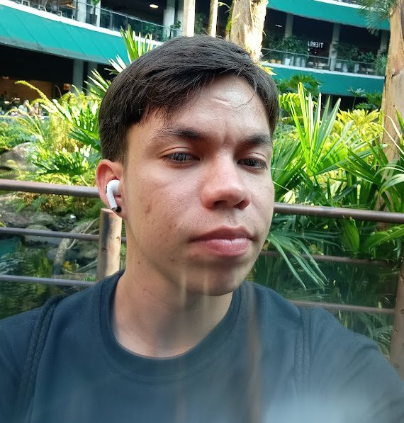

  
   
  Sebastian Giraldo
  <h2 align="center" style="font-size: 28px">Hi there 👋, I'm Trynag</h2>

👨‍💻 Tgo. Software
 

🔅 I'm currenly working at UNAD

<!--
**Trynag/Trynag** is a ✨ _special_ ✨ repository because its `README.md` (this file) appears on your GitHub profile.

Here are some ideas to get you started:

- 🔭 I’m currently working on ...
- 🌱 I’m currently learning ...
- 👯 I’m looking to collaborate on ...
- 🤔 I’m looking for help with ...
- 💬 Ask me about ...
- 📫 How to reach me: ...
- 😄 Pronouns: ...
- ⚡ Fun fact: ...
-->
